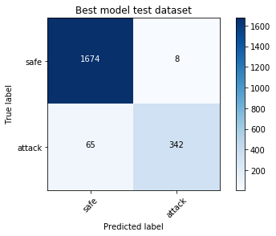

# Unsupervised Learning
## Intrusion Detection System

### Overview

The goal of intrusion detection is to correctly distinguish between when the system is under attack and when the system is not under attack. The goal of this project is to minimize the number of false positives (ideally to zero) while at the same time maximizing the number of true positives. The code in this repository achieves this goal:

* The supplied model achieves a Matthews correlation coefficient of 0.886 on the test set (1.0 is perfect correlation, 0.0 is random guessing)

* The supplied model achieves a true positive rate of 0.840 on the test set (1.0 is best value)

* The supplied model achieves a false positive rate of 0.005 on the test set (0.0 is best value)

Confusion matrix for the test dataset: 

### Domain

Industrial control systems (ICS) are computer systems that control the operation of industrial processes and historically have been designed to be operated in isolated environments. Increasingly over time components of these systems have been integrated into larger corporate networks and connected to the Internet without a corresponding attention to security. One domain where this has occurred is water distribution systems with the adoption of smart water technologies.

The Battle of the Attack Detection ALgorithms ([BATADAL](https://www.batadal.net)) was a recent competition to compare the performance of attack detection algorithms specifically for water distribution systems. There are three datasets provided by the [competition's website](https://www.batadal.net/data.html). They provide a simulated attack against a real, moderately-sized [water distribution system](https://www.researchgate.net/profile/Kegong_Diao/publication/235694686_Battle_of_the_Water_Calibration_Networks/links/00b7d5229e0cfe9afc000000.pdf). Each was generated by running extended-time hydraulic simulations with [EPANET toolkit](https://github.com/OpenWaterAnalytics/EPANET-Matlab-Toolkit).

### Files

report.md and report.pdf each contains the final written report.

img directory contains generated images for the written report

src directory contains python code for the project
	* metrics.py implements necessary metrics 
	* model.py implements classifier, including the final model
	* preprocessing.py implements various preprocessing routines
	* util.py implements loading and transforming datasets
	* visualization.py implement plotting code

### Data

The simulated attack data is obtained from the BATADAL [competition website](https://www.batadal.net/data.html).

### Reference

Riccardo Taormina and Stefano Galelli and Nils Ole Tippenhauer and Elad Salomons and Avi Ostfeld and Demetrios G. Eliades and Mohsen Aghashahi and Raanju Sundararajan and Mohsen Pourahmadi and M. Katherine Banks and B. M. Brentan and Enrique Campbell and G. Lima and D. Manzi and D. Ayala-Cabrera and M. Herrera and I. Montalvo and J. Izquierdo and E. Luvizotto and Sarin E. Chandy and Amin Rasekh and Zachary A. Barker and Bruce Campbell and M. Ehsan Shafiee and Marcio Giacomoni and Nikolaos Gatsis and Ahmad Taha and Ahmed A. Abokifa and Kelsey Haddad and Cynthia S. Lo and Pratim Biswas and M. Fayzul K. Pasha and Bijay Kc and Saravanakumar Lakshmanan Somasundaram and Mashor Housh and Ziv Ohar; "The Battle Of The Attack Detection Algorithms: Disclosing Cyber Attacks On Water Distribution Networks." Journal of Water Resources Planning and Management, 144 (8), August 2018. ([doi link](http://dx.doi.org/10.1061/(ASCE)WR.1943-5452.0000969), [bib](https://www.batadal.net/taormina18battle.bib))
