# Project Report

## I. Definition

### Project Overview

Industrial control systems (ICS) are computer systems that control the operation of industrial processes and historically have been designed to be operated in isolated environments. Increasingly over time components of these systems have been integrated into larger corporate networks and connected to the Internet without a corresponding attention to security [1][2]. One domain where this has occurred is water distribution systems with the adoption of smart water technologies [3].

The Battle of the Attack Detection ALgorithms (BATADAL) [4] was a recent competition to compare the performance of attack detection algorithms specifically against water distribution systems. This project will use the datasets provided by the the competition website [5] to build and test an attack detection algorithm (also sometimes referred to as intrusion detection).

### Problem Statement

The goal of intrusion detection is to correctly distinguish between when the system is under attack and when the system is not under attack. An attack detection algorithm with a high false positive rate (it raises an alert when no attack is present) is just as useless as an algorithm with a high false negative rate (it does not raise an alert when an attack is underway). The goal of this project is to minimize the number of false positives (ideally to zero) while at the same time maximizing the number of true positives.

The strategy for solving this problem comes out of the recognition that attacks are uncommon events that don't conform to expected behavior, which means any strategy capable of detecting these anomalies can detect attacks. The proposed solution is build a model that computes the likelihood of a given observation given the normal operating conditions and flagging the observations that deviate much more than the others. 

This is fundamentally an unsupervised learning problem, with the model first needing to learn latent (hidden) variables that are inferred from the observed sensor values using an expectation–maximization (EM) algorithm [6]. Possible techniques are Gaussian mixture models [7] and probabilistic principal component analysis [8] to approximate the latent variables which then can be used to compute the likelihood of a given observation. Finally, the model will need to use these likelihood values to label incoming observations  as indicating if the water distribution system is under attack or not under attack.

### Metrics

The Matthews correlation coefficient (MCC) will be used to evaluate this project as it is useful for binary classification and remains balanced even with classes of very different sizes [9]. It is calculated using the true positives (TP), true negatives (TN), false positives (FP), and false negatives (FN).

Possible values for MCC range from -1.0 (perfectly wrong classification) to +1.0 (perfect classification), but in practice the possible range is 0.0 (random guessing) to 1.0, as a negative MCC values means that inverting the binary classification results in a positive score. 

The naive model (either always predicting the water system is under attack or alternatively always predicting the system is not under attack) scores poorly, with a MCC of 0. By way of comparison, a naive model that always predicts the system is not under attack when evaluated with a metric that does not account for class imbalance (such as accuracy) would have an accuracy of 0.88 on the training set and an accuracy of 0.80 on the test set. Remember that an attack detection algorithm that does not detect any attacks is completely useless, thus the use of Matthews correlation coefficient allows for a proper evaluation of the final model.

An added benefit to the choice of MCC as an evaluation metric is that the BATADAL paper [4] reports the true positives, true negatives, false positives, and false negatives for every submitted model. The MCC of each model can be easily computed and compared with this project's MCC.

An additional metric to evaluate the project is the confusion matrix, for example the optimal confusion matrix for the test dataset looks like: 
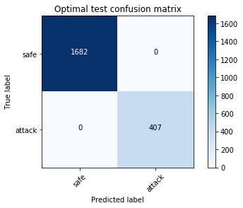

The upper left hand corner is the number of true negatives, the upper right hand corner is the number of false positives, the lower left hand corner is the number of false negatives and the lower right hand corner is the number of true positives.

## II. Analysis

### Data Exploration

There are three datasets provided by the competition's website [5]. They provide a simulated attack against a real, moderately-sized water distribution system [10]. Each was generated by running extended-time hydraulic simulations with EPANET toolkit [11].

This is the physical map of the full simulated water distribution network with the location of the nine programmable logic controllers (PLC): 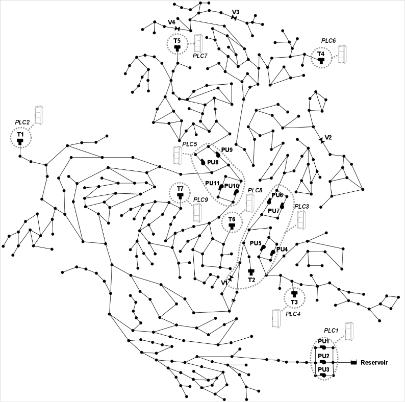

Each dataset contains tabular data reporting the time stamp and the observed values from 43 selected sensors (not all the sensors in the network).

The first training dataset is one year of data (06 January 2014 to 06 January 2015) without attacks and is used to determine the baseline of normal system operations. The second training dataset is six months of data (04 July 2016 to 25 December 2016) containing seven labeled attacks spanning 492 hourly time steps. The test set is three months of data (04 January 2017 to 01 April 2017) containing seven attacks spanning 407 hourly time steps.

Here's the logical connections between the 43 sensors in the datasets:
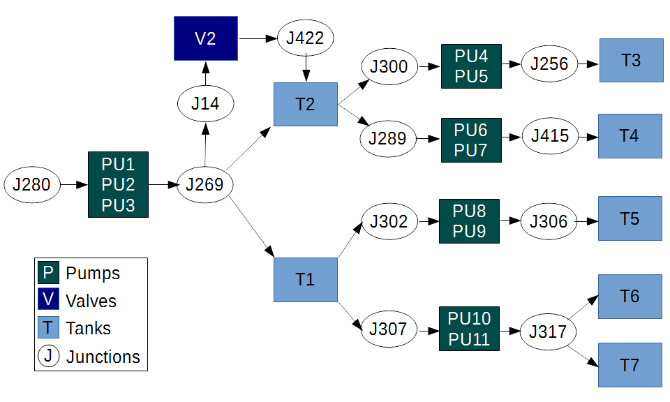

Available readings are: 

* the date and time of the sensor reading ('DATETIME') in the format DD/MM/YY HH.

* the water level in meters for each of seven water tanks ('L_T1' through 'L_T7').
    
* the status (binary: 0 for off/closed, 1 for on/open) of elven pumps and one valve in the system ('S_PU1' through 'S_PU11' and 'S_V2').

* the flow in liters per second for each pump and valve in the system (pumps are 'F_PU1' through 'F_PU11' and the only valve is 'F_V2').

* the suction pressure and discharge pressure in pascals for twelve junctions in the system (e.g. 'P_J280' or 'P_J14'). For example, 'P_J280' is the suction pressure for the first pumping station ('PU1', 'PU2', 'PU3') and 'P_269' is the discharge pressure.

Additionally, I added several additional columns:

* the attack label (binary: 0 for safe, 1 for under attack) that identify if the system is under attack ('ATT_FLAG').

* an attack label for each sensor in the dataset (binary: 0 for safe, 1 for under attack)  that identify the if the sensor has been compromised. These labels are unused in this project but see the improvement section in the conclusion for discussion.

A further complication in intrusion detection and recreated in the datasets is that when an attacker compromises a programmable logic controller or similar component, they can also manipulate the sensor data to conceal their actions. A typical strategy found in the datasets is known as a replay attack, when the attacker records normal sensor data and then "replays" it when they actually carry out the attack, concealing the true abnormal sensor data.

### Exploratory Visualization

The data is high dimensional and therefore difficult to visualize using two dimensions. One approach is using t-distributed Stochastic Neighbor Embedding (t-SNE) [12] to reduce the data into lower-dimensions.

Here is a plot of the first training dataset without any attacks after being reduced to two dimensions using t-SNE. The x-axis is the first dimension and the y-axis is the second dimension t-SNE computed. 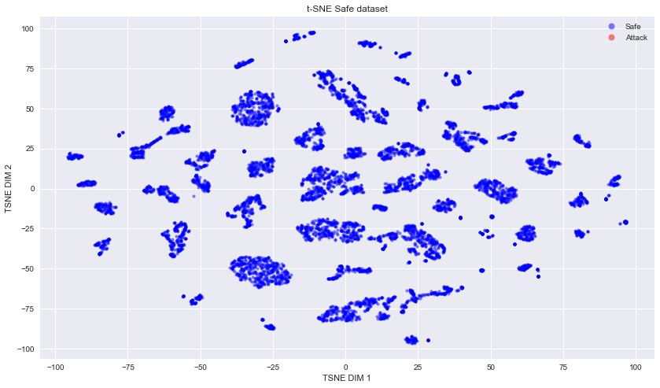

The observations have been separated into many clusters with a few observations falling outside the clusters.

Next is a plot of the second training dataset with attacks after being reduced to two dimensions using t-SNE. Same setup as the first plot. 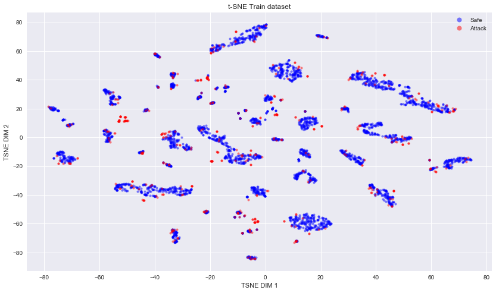

The main takeaway from this plot is how some attack observations are clearly clustered together away from safe observations and how some are intermingled with the safe observations (possibly indicating that they are part of a replay attack).

Next is a plot of the test dataset after being reduced to two dimensions using t-SNE. Same setup as the previous plots. 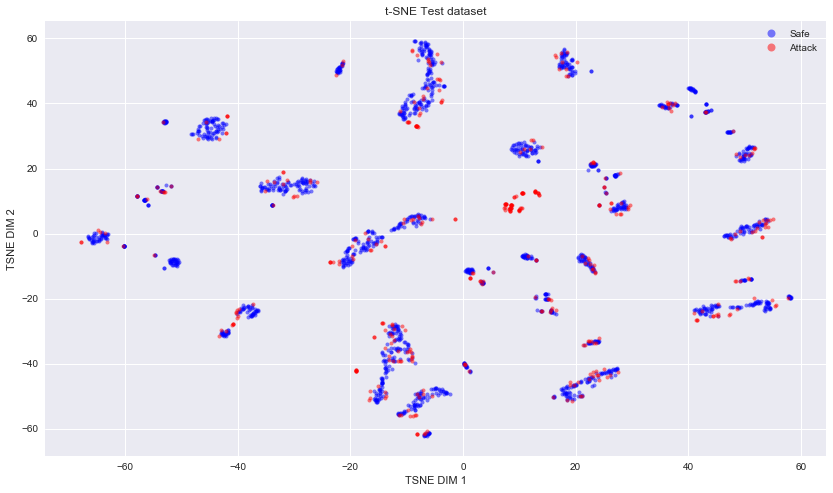

Note that there are fewer attack-only clusters and most attacks seem to be near safe clusters. This illustrates the main challenge of identifying and separating anomalous observations from normal operating conditions.

To test the assumption that the likelihood will be useful in classifying if the system is under attack or not, we can plot the likelihood of observations. Here is a plot of the likelihood of observations in the first training dataset without any attacks. The x-axis is the time-step in hours and the y-axis is the likelihood of the observation clipped (for legibility reasons) and scaled between 0 and 1: 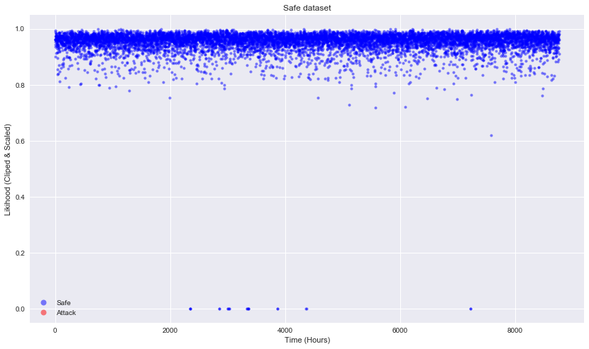

Note how most of the observations are clustered near the top of the graph (where the observation is likely) but there are still a few outliers clipped at the bottom (where the observation is unlikely).

Next is a plot of the likelihood of observations in the second training dataset, the one with attacks. The plot setup is the same as the previous graph: 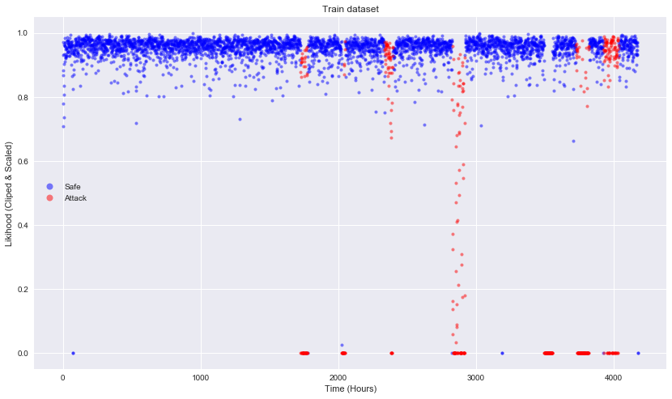

See how all seven attacks are clearly visible at the bottom of the graph. Of particular interest is the fifth attack: 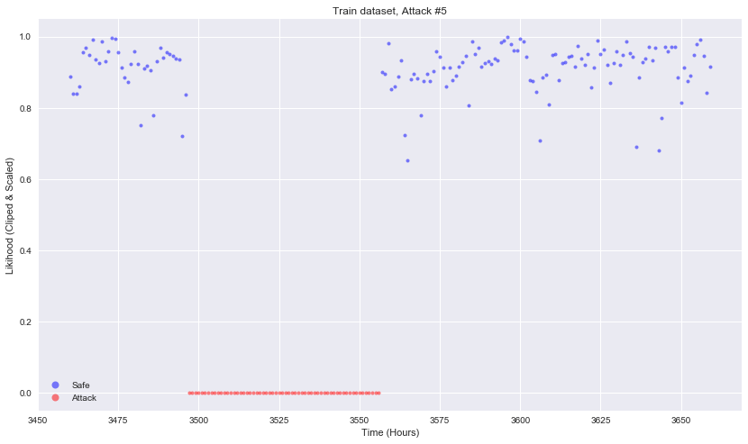

All of the observations during the attack are clipped to 0, indicating that they are unlikely. The fifth attack is the only one in the second training dataset without any concealment and the attacks are quite visible. This validates the decision to use likelihood to classify the data.

Finally, is the plot of the likelihood of observations in the test dataset, with the same setup as the previous three plots: 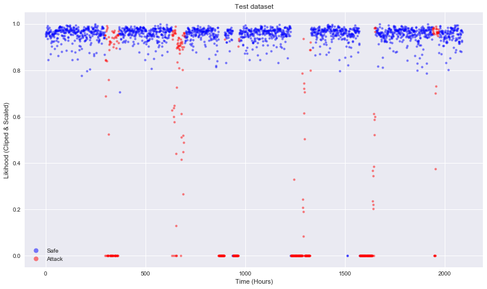

Again, most of the observations where the system is under attack are clustered near the bottom of the plot and are considered unlikely given the first training dataset.

### Algorithms and Techniques

To calculate the likelihood of an observation, we first assume that each feature in the observation is drawn from some latent Gaussian (normal) distribution. Since the actual relationship between the observed features and the latent features are unknown the expectation-maximization (EM) algorithm [6] can be used to approximate the relationship. First, it initially generates a number of clusters (usually using k-means or randomly) and computes for each observation a probability of that observation being generated by each component of the model. The algorithm then modifies the parameters to maximize the likelihood of the observations given those cluster assignments. Assuming sufficiently many points per cluster, this process is guaranteed to converge to a local optimum [13].

Next, we compute the sample covariance matrix [14] for the latent variables, which generalizes variance into multiple dimensions. Correlation coefficients are the normalized  covariance. The inverse of the covariance matrix is typically known as the precision matrix and this is necessary to compute the log-likelihood.

Using the formula obtained from Tipping & Bishop [8], the log-likelihood of observing all ${N}$ observations under this model is: 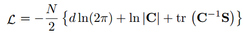

where ${S}$ is the sample covariance matrix of the observed data: 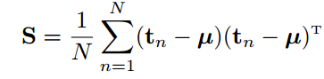

and ${\it d}$ is the number of latent features, ${\bf C}$ is the covariance matrix, ${\bf C} ^{-1}$ is the precision matrix (the inverse of the covariance matrix), and ${tr}$ is the observed data with the mean subtracted. Setting ${N}$ to one allows allows us to compute the log-likelihood of each observation. See 'samplewise_log_likelihood' in util.py for an implementation.

There are several algorithms that may be useful in generating the latent variables and their covariance matrix:

* Gaussian mixture models [15] are an obvious starting choice as they implement the  expectation-maximization algorithm directly. Important parameters are:

    * The number of latent features (usually called mixture components).
    
    * the covariance type, for example where each each component has its own general covariance matrix or where all components share the same general covariance matrix.
    
    * how initial clusters are generated (either by using k-means or randomly).
    
    * the number of EM iterations to perform.

* Factor Analysis [16], which assumes a linear transformation from the latent factors with  added Gaussian noise into the observed data. Important parameters are:
    
    * the number of components to use.
    
    * the number of EM iterations to perform.

* Probabilistic Principal Component Analysis [8][17] is similar to and derived from factor analysis by restricting the model to assume that the Gaussian noise is even isotropic (where all diagonal entries are the same). Important parameters are:
    
    * the number of components to use.
    
    * if the variances should be normalized (called 'whitening').

These algorithms are fitted to the first training dataset (without any attacks), the second training dataset (with attacks) or both. Then the log-likelihood of each sample given the initial fitted data is obtained. The log-likelihood can then be passed to a classifier in-order to classify each observation as under attack or safe.

* K-Nearest Neighbors [18] is a simple (and effect) classifier for this purpose. It takes a vote of the the ${k}$ nearest observations to determine the classification. Important parameters are:

    * the number of neighbors to query
    
    * how to weigh the votes, for example to weigh each one equally, or to scale the weight based on the distance, where nearer votes have greater influence.
    
    * what distance metric to use, such as Euclidean distance

### Benchmark

A benchmark model is the competition submission from Chandy et al. [19]. It uses a variational auto-encoder (VAE) based model the learns by maximizing a variational lower bound of the likelihood of the data (a higher lower bound implies a better fit to the observed data). There are two main components: an encoder that learns a low-dimensional representation of the high-dimensional data and a decoder that learns to covert the latent representation back into the original data. The VAE model is trained on the first training set to learn the normal system operation without attacks and then applied to the second training set to compute a logarithmic reconstruction probability of the data and a low value suggests a possible anomalous behavior.

Chandy et al. also needed to specify a probability threshold to classify if the system is safe or under attack. Additionally they added a rule violation model to determine if the data from the sensor readings is operationally, physically, or hydraulically possible as a further sanity check on the VAE model. 

The benchmark model achieved a MCC of 0.429 on the test dataset (computed using the confusion matrix presented in [4]). The VAE model was successful in identifying all attacks against the system, but it also generated a large number of false positives: a full 60% of the attacks identified by the model were false positives.

## III. Methodology

### Data Preprocessing

Numerous preprocessing techniques were attempted, including:

* normalizing all input

* normalizing input based on the hour of the day (compute mean and standard deviation for each 24 hours, trying to capture the contextual information such as how the water systems differs from hour to hour).

* dropped features with zero variance (a few pumps are never turned on in either of the training datasets).

* merging the pumps into pumping stations (for example, pumps 1, 2, and 3 all belong to the same pumping station, and 3 is never activated).

* dimensionality reduction with principal component analysis; the number of components was selected based on the amount of explained variance contained within those components: first (42%), second (28%), third (12%), fourth (8%), fifth (6%), and sixth (3%). Cumulatively, the first six components explained 99% of the variance.

* splitting the data into continuous variables (flow, pressure) and discrete variables (pump and valve status)

* splitting the data into the five district metering areas. 

None of these preprocessing steps improved the performance, and in many cases resulted in much worse performance. So no data preprocessing is used for the project.

### Implementation

The datasets are downloaded from the competition's website [5] and are labeled with attacks. The implementation of the Matthews correlation coefficient is a numpy adaptation of a keras metric. One complication is how MCC is unsuitable to evaluating the first training set (without any attacks) because of the single class the number of true positives are always zero, so MCC returns 0. This was addressed by instead evaluating the algorithm's performance on the first training set by the number of false positives (ideally zero). 

Next, visualization code to generate the likelihood plots was used to validate the decision to use log-likelihood as a possible method to identify if the system is under attack or not. The main challenge was plotting the values legibly, as a few extreme values distorted the scale, even with a log scale. The solution was clipping the values.

All the models tested follow the same basic structure. Each model first learns latent variables from the training datasets using unsupervised learning techniques such as Gaussian mixture models or probabilistic principal component analysis, then uses these latent variable's covariance matrix to estimate the likelihood of an observation. The likelihoods are classified as indicating the system is under attack or not using a K-Nearest Neighbors classifier. Each model's parameters are:

* Which kind of algorithm to learn the latent variables (possible values are Gaussian mixture models, factor analysis, or probabilistic principal component analysis).

* the number of latent variables (components) to use (possible values range from 1 to 43, equal to the number of possible sensor readings).

* the number of neighbors the KNN classifier polls (possible values range from 1 to 100).

* and how to weigh the votes (possible values are 'uniform' where each vote is equal or 'distance' where each vote is scaled based on the distance, where nearer votes have greater influence).

* when using probabilistic principal component analysis, if the variances should be normalized (possible values are True or False).

Each configuration is tested on previously unseen validation data (to test how well that configuration generalizes) and the  the number of false positives it returns on the first training dataset without any attacks (to reduce the number of false positives).

### Refinement

To obtain the final model different covariance estimators and parameters were used and evaluated.

The second training dataset (with attacks) was split in half, into a training and validation set, preserving the class imbalance. The first training dataset is referred to as the safe set (because it contains no attacks) and used to fit a latent variable model to generate the covariance matrix (to learn the normal water system operation). The training set was then used to fit the K-Nearest Neighbors classifier using the log-likelihood computed using the inverse covariance matrix. 

Each model will be evaluated using the number of false positives on the safe set and the Matthews correlation coefficient and confusion matrix of the validation set. The goal is to minimize the number of false positives (to zero) and maximize the MCC.

**Initial Solution**

The initial solution was with a Gaussian mixture model, with 1 component, full covariance type, a K Neighbors Classifier with 10 neighbors, and 'uniform' weights (each vote is weighed equally). This initial solution has 21 false positives on the safe dataset and a MCC of 0.735 on the validation set. Here's the confusion matrix of the model's predictions on the validation set: 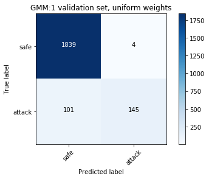

**Intermediate Solutions**

Changing the K Neighbors Classifier to have 'distance' weights (each neighbor's vote is weighed by the distance from the observation) massively increases the number of false positives on the safe set up to 333 and a reduces the MCC to 0.667.

The number of neighbors the K Neighbors Classifier has little impact in the false positive rate with a large number of false positives when less than five neighbors and similarly small false positive rates with five or more neighbors. Increasing the number of neighbors beyond ten has very little impact.

More components in the Gaussian mixture model results in fewer false positives, with best number of components I found to be 36. This results in 3 false positives on the safe dataset and a MCC of 0.879.

Factor Analysis was experimented with, the best results using 43 components and resulted in 20 false positives on the safe dataset and a MCC of 0.638.

Principal Component Analysis was next. Initial results with 43 components and no whitening obtained 0 false positives on the safe dataset and an MCC of 0.380.

When whitening was enabled, the number of false positives increased to 46 on the safe dataset but the MCC also increased to 0.575.

The optimal number of components I found to be 28 with whitening, resulting in 4 false positives on the safe set and an MCC of 0.747 on the validation set.

Next I tried combinations of covariance estimators, one fitted to the safe dataset and the other fitted to the training set. The initial idea was to allow for two dimensions to cluster similar points together, hopefully improving MCC and simultaneously reducing false positives. 

Two GMM each with 36 components resulted in 1 false positive on the safe dataset and a MCC of 0.879.

A GMM with 36 components fitted to the safe set and FA with 43 components fitted to the training set resulted in 3 false positives on the safe dataset and a MCC of 0.881.

**Final Solution**

I found that a GMM fitted to the safe dataset and PCA fitted to the training dataset had the best results. Specifically 36 GMM components and 28 PCA components with whitening resulted in 0 false positives on the safe dataset and a MCC of 0.878: 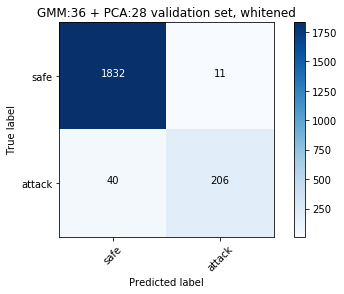

I tried varying the number of neighbors the K neighbors classifier used, but 10 was the best I found. The main accomplishment was eliminating the number of false positives on the safe set without compromising the MCC.

## IV. Results

### Model Evaluation and Validation

The best model uses a Gaussian Mixture model with 36 components fitted to the safe dataset and a Principal Component Analysis model with 28 components fitted to the training dataset with whitening enabled. These compute the log likelihood of incoming observations and pass that information to a K-Nearest Neighbors classifier to predict if those likelihood values indicate the system is under attack or not.

The test dataset is used to evaluate the performance of the best model.

The best model has a Matthews correlation coefficient of 0.886 on the test dataset and here is the confusion matrix: 

Here is a plot of the best model's predictions of the test set. The x-axis is time (hours) and the y-axis is the probability that the system is not under attack. The default threshold of 0.5 is used: 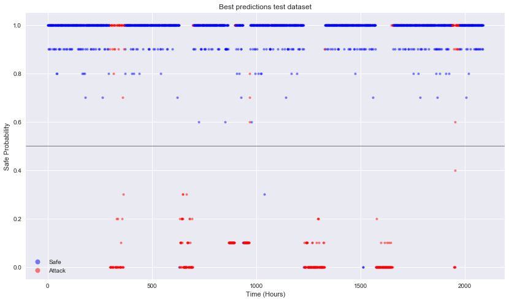

### Justification

The final solution's Matthews correlation coefficient of 0.886 is more than double that of the benchmark model's MCC of 0.429 and is also fairly close to the perfect MCC of 1. This high MCC means that the solution can fairly correctly predict when the water distribution system is under attack or not, achieving the orignal goal of the project.

The final solution also achieves the second goal of the probject, by generating few false positives. Only 8 on the test set. This means that when the solution predicts the system is under attack, there is high confidence that the system actually is (only 2% of the alerts are false alarms). This means that the solution can be used in a real-world context, as very few of the alerts waste human time. 

## V. Conclusion

### Reflection

In this project, I developed and optimized an intrusion detection system designed to work with a real-world water distribution system. Overall I built a successful model capable of distinguishing when the system is under attack or not, even when the attacker attempts to conceal the intrusion.

I was surprised by and found interesting how well the basic setup worked. Computing the log-likelihood of an observation was quite powerful in predicting if the system was under attack or not, even with concealment. I expected the replay attacks to be much more difficult to identify, but the solution does identify them. I attribute this to how the attackers don't compromise further downstream sensors, so the abnormality can be inferred by the mismatch. The two attacks that the final solution has the most difficulty with (the first and seventh attacks in the test set) target the furthest downstream sensors in the datasets.

Another interesting aspect of the project was how in my proposal, I anticipated the need to extend the approach with neural networks or further preprocessing. Indeed, Chandy et al [19] the benchmark model uses a complicated neural network architecture that takes days to train on high end GPUs and preforms worse than the solution model that takes seconds to train. 

### Improvement

One aspect of improvement would be for the solution to also identify the components that are compromised. A major limitation of intrusion detection systems is how the binary under attack or not under attack prediction doesn't really help a human or another defensive system to respond. It only indicates a need to respond but not how or where. A superior model could aid more directly in how to respond to an attack.

I think the hyper-parameter search found a fairly good optima and more effort in searching wouldn't necessarily result in better performance, especially looking that the model's predictions on the test set: 

Few mislabeled attack points are near the threshold and most are predicted to be not attacks with probability of 1. This suggests that the reported results are near the global optimum for this method of predicting attacks based on the log-likelihood of observations. One method to attempt to separate out these false negatives might be to utilize the time series nature of the datasets in an attempt to discover contextual anomalies that are only anomalies given the preceding and subsequent time steps.

One interesting direction of improvement would be to use this classifier as a preprocessing step to augment another model. For example, the solution could be used to label a unlabeled dataset to allow a supervised approach to an unsupervised learning problem.

### Refrences

[1] Stouffer et al. (2013) "NIST Special Publication 800-82 Guide to Industrial Control Systems (ICS) Security" [PDF](https://nvlpubs.nist.gov/nistpubs/SpecialPublications/NIST.SP.800-82r2.pdf)

[2] Rose Tsang (2010) "Cyberthreats, Vulnerabilities and Attacks on SCADA Networks" [PDF](https://web.archive.org/web/20120813015252/http://gspp.berkeley.edu/iths/Tsang_SCADA%20Attacks.pdf)

[3] Rasekh et al. (2016) "Smart Water Networks and Cyber Security." DOI: [10.1061/(ASCE)WR.1943-5452.0000646](https://ascelibrary.org/doi/10.1061/%28ASCE%29WR.1943-5452.0000646)

[4] Taormina et al. (2018) "The Battle of the Attack Detection Algorithms: Disclosing Cyber Attacks on Water Distribution Networks" DOI: [10.1061/(ASCE)WR.1943-5452.0000969](https://ascelibrary.org/doi/10.1061/%28ASCE%29WR.1943-5452.0000969)

[5] BATANAL Competition Datasets. URL: https://www.batadal.net/data.html

[6] Expectation–maximization algorithm Wikipedia. URL: https://en.wikipedia.org/wiki/Expectation%E2%80%93maximization_algorithm

[7] Mixture Model from Wikipedia. URL: https://en.wikipedia.org/wiki/Mixture_model

[8] Tipping & Bishop. (1999) "Mixtures of Probabilistic Principal Component Analysers", Neural Computation 11(2), pp 443–482. MIT Pres. [PDF](http://www.miketipping.com/papers/met-mppca.pdf)

[9] Boughorbel, S.B (2017). "Optimal classifier for imbalanced data using Matthews Correlation Coefficient metric".

[10] Ostfeld, A., et al. (2011). Battle of the water calibration networks. Journal of Water Resources Planning and Management, 138(5), 523-532. [PDF](https://www.researchgate.net/profile/Kegong_Diao/publication/235694686_Battle_of_the_Water_Calibration_Networks/links/00b7d5229e0cfe9afc000000.pdf)

[11] EPANET MATLAB Toolkit Github. URL: https://github.com/OpenWaterAnalytics/EPANET-Matlab-Toolkit

[12] t-SNE github page. URL: https://lvdmaaten.github.io/tsne/

[13] Expectation-maximization scikit-learn user guide. URL: http://scikit-learn.org/stable/modules/mixture.html#expectation-maximization

[14] Covriance Matrix Wikipedia. URL: https://en.wikipedia.org/wiki/Covariance_matrix

[15] Gaussian mixture models scikit-learn user guide. URL: http://scikit-learn.org/stable/modules/mixture.html#gmm

[16] Factor Analysis scikit-learn documentation. URL: http://scikit-learn.org/stable/modules/generated/sklearn.decomposition.FactorAnalysis.html

[17] Principal component analysis (PCA) scikit-learn documentation. URL: http://scikit-learn.org/stable/modules/generated/sklearn.decomposition.PCA.html

[18] K Neighbors Classifier scikit-learn documentation. URL: http://scikit-learn.org/stable/modules/generated/sklearn.neighbors.KNeighborsClassifier.html

[19] Chandy et al. (2017) "Cyberattack Detection using Deep Generative Models with Variational Inference" arXiv: [1805.12511v1](https://arxiv.org/abs/1805.12511)

### BATADAL Dataset Reference

Riccardo Taormina and Stefano Galelli and Nils Ole Tippenhauer and Elad Salomons and Avi Ostfeld and Demetrios G. Eliades and Mohsen Aghashahi and Raanju Sundararajan and Mohsen Pourahmadi and M. Katherine Banks and B. M. Brentan and Enrique Campbell and G. Lima and D. Manzi and D. Ayala-Cabrera and M. Herrera and I. Montalvo and J. Izquierdo and E. Luvizotto and Sarin E. Chandy and Amin Rasekh and Zachary A. Barker and Bruce Campbell and M. Ehsan Shafiee and Marcio Giacomoni and Nikolaos Gatsis and Ahmad Taha and Ahmed A. Abokifa and Kelsey Haddad and Cynthia S. Lo and Pratim Biswas and M. Fayzul K. Pasha and Bijay Kc and Saravanakumar Lakshmanan Somasundaram and Mashor Housh and Ziv Ohar; "The Battle Of The Attack Detection Algorithms: Disclosing Cyber Attacks On Water Distribution Networks." Journal of Water Resources Planning and Management, 144 (8), August 2018. ([doi link](http://dx.doi.org/10.1061/(ASCE)WR.1943-5452.0000969), [bib](https://www.batadal.net/taormina18battle.bib))
